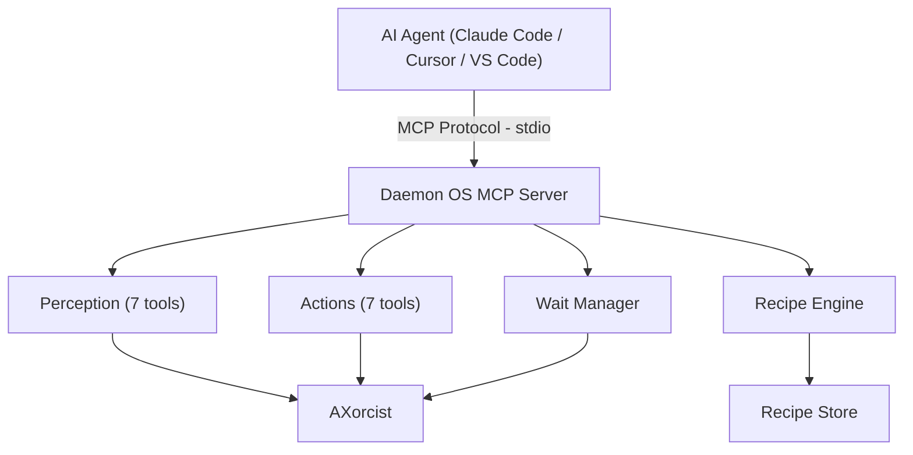

<p align="center">
  
</p>

<p align="center">
  
</p>

<p align="center">
  <a href="LICENSE"></a>
  
  
  
  
</p>

---

Your AI agent can write code, run tests, search files. But it can't click a button, send an email, or fill out a form. It lives inside a chat box.

**Daemon OS changes that.** One install, and any AI agent can see and operate every app on your Mac.

```
You:     "Send an email to sarah@company.com about the Q4 report"
Agent:   daemon_run recipe:"gmail-send" params:{recipient, subject, body}
         → Compose opens, fields fill, email sends. Done.
```

## Install

```bash
brew install hammadxcm/daemon-os/daemon-os
daemon setup
```

That's it. `daemon setup` handles permissions, MCP configuration, and recipe installation.

## Why Daemon OS?

Other computer-use tools take screenshots and guess what's on screen. Daemon OS reads the macOS accessibility tree — structured, labeled data about every element in every app. No vision model needed. No pixel-guessing.

And when it figures out a workflow, it saves it. Other tools repeat the same expensive reasoning every time.

- **Self-learning** — A frontier model figures out the workflow once. A small model runs it forever.
- **Transparent** — Recipes are JSON. Read every step before running. No black box.
- **Native** — Accessibility tree, not screenshots. Structured data, not pixel coordinates.
- **Any app** — Not just browsers. Slack, Finder, Messages — anything on your Mac.
- **Local** — Your data never leaves your machine.
- **Open** — MCP protocol. Works with Claude Code, Cursor, VS Code, or any MCP client.

| | | Daemon OS | Anthropic Computer Use | OpenAI Operator | OpenClaw |
|:---:|------|:--:|:--:|:--:|:--:|
| 👀 | **How it sees** | Accessibility tree + screenshots | Screenshots only | Screenshots only | Browser DOM |
| 🖥️ | **Native apps** | Any macOS app | Any (via pixels) | Browser only | Browser only |
| 🧠 | **Learns workflows** | JSON recipes | No | No | No |
| 🔒 | **Data stays local** | Yes | Depends on setup | No (cloud) | Yes |
| 📖 | **Open source** | MIT | No | No | MIT |

## How It Works

Daemon OS connects to your AI agent through [MCP](https://modelcontextprotocol.io) and gives it 20 tools to see and operate your Mac. It reads the macOS accessibility tree for structured data about every app, and takes screenshots when visual context is needed. Click, type, scroll, press keys, manage windows. Any app, not just browsers.

```
You:     "Download the latest paper on chain-of-thought prompting from arXiv"
Agent:   daemon_run recipe:"arxiv-download" params:{query:"chain of thought prompting"}
         → Navigates to arXiv, searches, opens PDF, downloads to Desktop. Done.
```

Works with Claude Code, Cursor, VS Code, or anything that speaks MCP.

## Tech Stack

<p align="center">
  
</p>

## 20 Tools

| | Tool | What it does |
|:---:|------|-------------|
| 🔍 | `daemon_context` | Get the current app, window title, URL, focused element, and all interactive elements on screen |
| 🔍 | `daemon_state` | List every running app with its windows, positions, and sizes |
| 🔍 | `daemon_find` | Search for elements by name, role, DOM id, or CSS class across the entire UI |
| 🔍 | `daemon_read` | Extract text content from any app, with depth control for nested content |
| 🔍 | `daemon_inspect` | Get complete metadata for one element: role, position, actions, DOM id, editable state |
| 🔍 | `daemon_element_at` | Identify what element is at a specific screen coordinate |
| 📸 | `daemon_screenshot` | Capture a window screenshot for visual debugging |
| 🎯 | `daemon_click` | Click an element by name, DOM id, or screen coordinates |
| ⌨️ | `daemon_type` | Type text into a specific field by name, or at the current cursor |
| ⌨️ | `daemon_press` | Press a single key like Return, Tab, Escape, or arrow keys |
| ⌨️ | `daemon_hotkey` | Press key combinations like Cmd+L, Cmd+Return, Cmd+Shift+P |
| 🎯 | `daemon_scroll` | Scroll up, down, left, or right in any app window |
| 🪟 | `daemon_focus` | Bring any app or specific window to the front |
| 🪟 | `daemon_window` | Minimize, maximize, close, move, or resize any window |
| ⏳ | `daemon_wait` | Wait for a URL change, element to appear or disappear, or title change |
| 📦 | `daemon_recipes` | List all installed recipes with descriptions and parameters |
| ▶️ | `daemon_run` | Execute a recipe with parameter substitution |
| 📦 | `daemon_recipe_show` | View the full steps and configuration of a recipe |
| 📦 | `daemon_recipe_save` | Install a new recipe from JSON |
| 📦 | `daemon_recipe_delete` | Remove an installed recipe |

## Recipes

When your agent figures out a workflow, it saves it as a recipe. A recipe is a JSON file with steps, parameters, and wait conditions. Transparent and auditable.

**A frontier model figures out the workflow once. A small model runs it forever.**

```bash
# One command sends an email
daemon_run recipe:"gmail-send" params:{"recipient":"hello@example.com","subject":"Hello","body":"World"}

# 7 steps, 30 seconds, 100% reliable
```

Bundled recipes: `gmail-send`, `slack-send`, `finder-create-folder`, `arxiv-download`

- Recipes are just JSON. Read every step before running.
- Share with your team. One person learns the workflow, everyone benefits.
- Chain recipes together. The agent knows when to call what.
- Write once with Claude or GPT-4. Run forever with Haiku.

## MCP Client Configuration

`daemon setup` auto-configures your MCP client. For manual configuration, add to your client config:

<details>
<summary><strong>Claude Code</strong></summary>

```json
{
  "mcpServers": {
    "daemon-os": {
      "type": "stdio",
      "command": "/usr/local/bin/daemon",
      "args": ["mcp"]
    }
  }
}
```
</details>

<details>
<summary><strong>Cursor</strong></summary>

Add to `.cursor/mcp.json`:

```json
{
  "mcpServers": {
    "daemon-os": {
      "type": "stdio",
      "command": "/usr/local/bin/daemon",
      "args": ["mcp"]
    }
  }
}
```
</details>

<details>
<summary><strong>VS Code</strong></summary>

Add to `.vscode/mcp.json`:

```json
{
  "servers": {
    "daemon-os": {
      "type": "stdio",
      "command": "/usr/local/bin/daemon",
      "args": ["mcp"]
    }
  }
}
```
</details>

<details>
<summary><strong>Generic MCP Client</strong></summary>

```json
{
  "mcpServers": {
    "daemon-os": {
      "type": "stdio",
      "command": "/usr/local/bin/daemon",
      "args": ["mcp"]
    }
  }
}
```

The server ships agent instructions in the MCP `initialize` response, so connected agents automatically learn how to use the tools.
</details>

## CLI Commands

| Command | Description |
|---------|-------------|
| `daemon mcp` | Start the MCP server (used by MCP clients) |
| `daemon setup` | Interactive first-time setup wizard |
| `daemon doctor` | Diagnose issues and suggest fixes |
| `daemon status` | Quick health check |
| `daemon version` | Print version |

## Diagnostics

```bash
$ daemon doctor

  ✓ Accessibility: granted
  ✓ Screen Recording: granted
  ✓ Processes: 1 daemon MCP process
  ✓ MCP Config: daemon-os connected
  ✓ Recipes: 4 installed
  ✓ AX Tree: 12/12 apps readable

  All checks passed. Daemon OS is healthy.
```

## Architecture



## Build From Source

```bash
git clone https://github.com/hammadxcm/daemon-os.git
cd daemon-os
swift build
.build/debug/daemon setup
```

Requires Swift 6.2+ and macOS 14+.

## Project Stats

~4,500 lines of Swift · 161 tests · 23 test suites

## Credits

Built on [AXorcist](https://github.com/steipete/AXorcist) by [@steipete](https://github.com/steipete) — the macOS accessibility engine that makes everything possible.

## Documentation

- [Architecture](docs/Architecture.md) — module design, data flow, and key decisions
- [Setup](docs/Setup.md) — prerequisites, installation, and permissions
- [Tools](docs/Tools.md) — complete reference for all 20 tools
- [Recipes](docs/Recipes.md) — writing and managing replayable workflows
- [Contributing](docs/Contributing.md) — development setup, testing, and PR process
- [Troubleshooting](docs/Troubleshooting.md) — common errors and fixes

## Contributing

See [docs/Contributing.md](docs/Contributing.md). We need recipes for more apps, testing on different setups, and bug reports. If you're building AI agents that do real things, this is the project.

## License

MIT

<p align="center">
  
</p>
